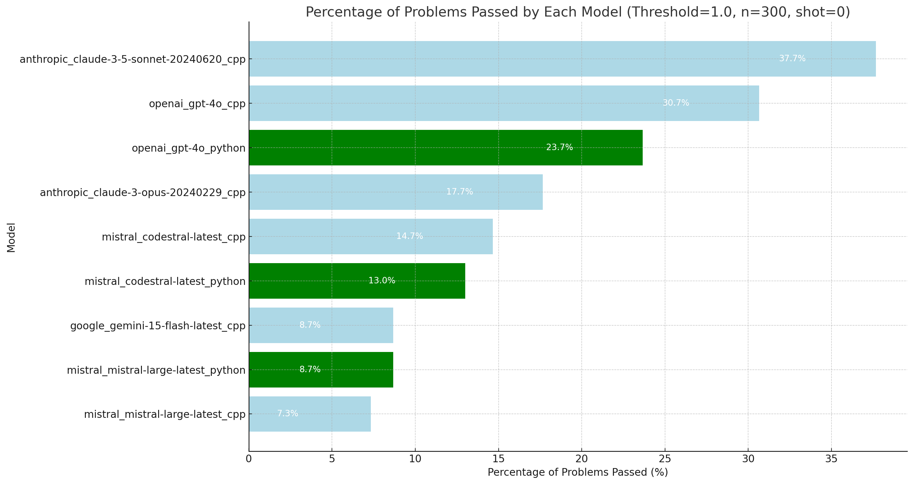
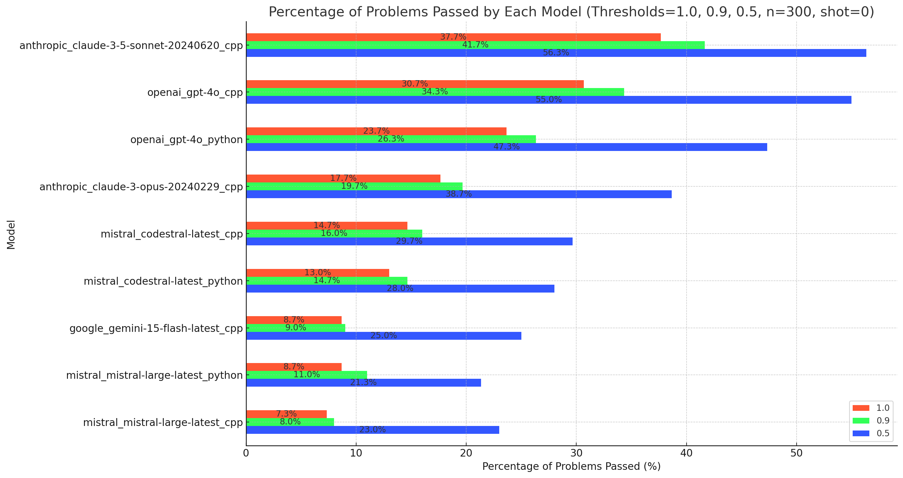
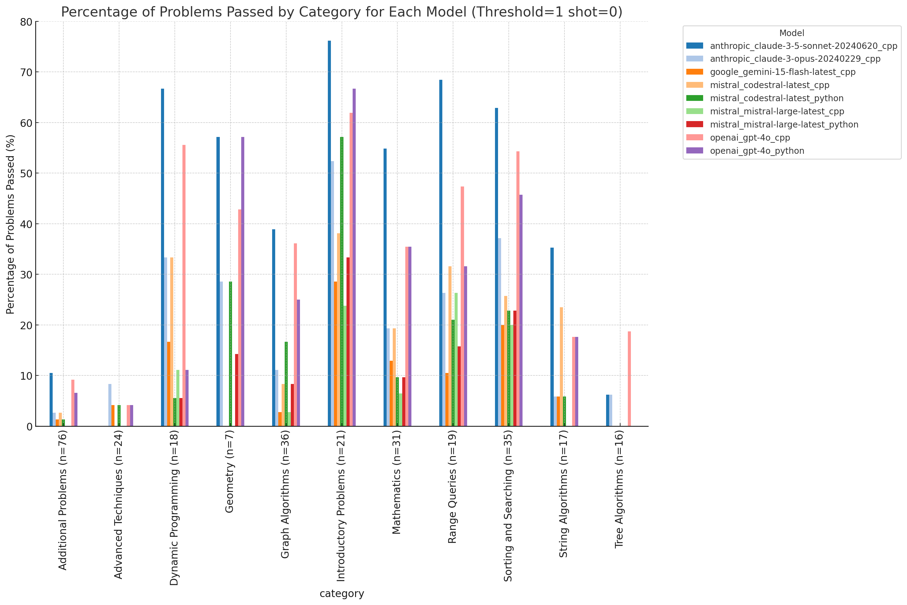
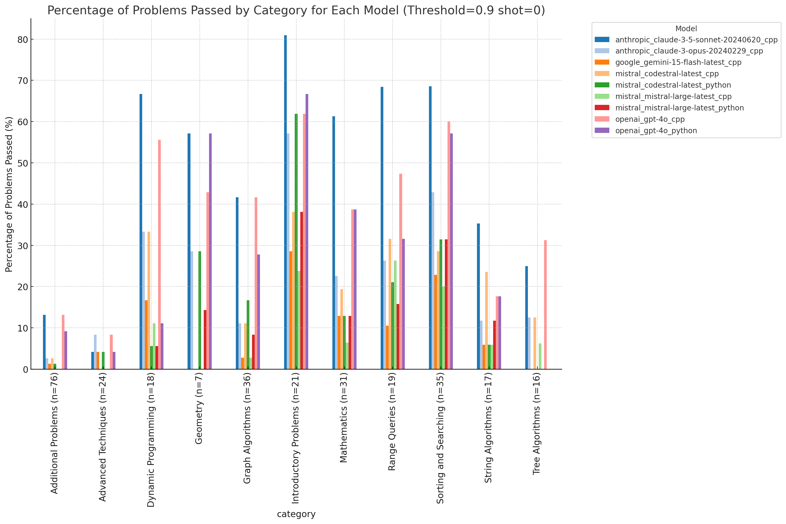
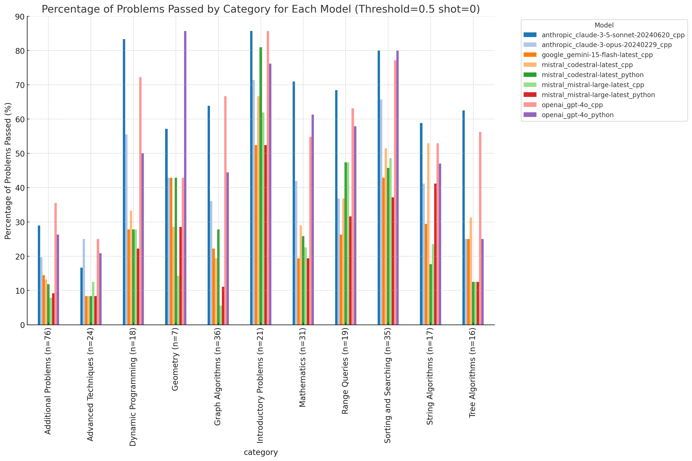

# Competitive Coding Benchmark

This benchmark aims to evaluate the performance of different LLMs against high-quality representative competitive coding problems sourced from [cses.fi](https://cses.fi/). These problems span a wide range of categories that require creative thinking and problem-solving ability.

**Just wanna see the results:** [Skip to Benchmark Results](#results-benchmark)

The code is designed to allow easy addition of new providers. Take a look at the providers folder to get inspiration from the currently implemented providers: `Anthropic, Google, Huggingface (not tested), Mistral, and OpenAI` are currently supported. It should also be easy to add new judges; currently supported are `Python, C++, and Java (experimental)`, as they represent the most commonly used languages in competitive coding.

**WARNING**: This repo is currently in a toy status. Use at your own risk.

## How to run a benchmark 

Benchmarks can be defined in the root folder.
You can define `config.json` with the following parameters.

```json
{
    "ignore_time_limits": false, 
    "provider": "openai", 
    "api_key": "<API_KEY>", 
    "model": "gpt-4o",
    "base_prompt": "You are a world-class competitive programmer. Go step by step through the following problem. At the end, provide the entire solution in a markdown cpp block.",
    "categories": ["String Algorithms", "Sorting and Searching", "Advanced Techniques", "Additional Problems", "Dynamic Programming", "Graph Algorithms", "Introductory Problems", "Tree Algorithms", "Range Queries", "Mathematics", "Geometry"],
    "shots": 3,
    "language": "cpp",
    "continue_from_log": "benchmark/openai_gpt-4o_log.json" 
}
```

`categories` can be left empty `[]` to run the benchmark on all categories. The `continue_from_log` parameter is necessary if you want to continue a benchmark that was abruptly stopped. Leave this empty if you are starting a new benchmark. The rest should be quite self-explanatory. The benchmark results can be found in the `benchmark` folder with the following format `<provider>_<model>_<language>_log.json`.

Once you have defined your `config.json`, you can start running the benchmark with:

```bash
python -m venv competitive-coding-bench
source competitive-coding-bench/bin/activate
pip install -r requirements.txt

python3 main.py
```

The output will look something like this for each problem. More ways to evaluate the data need to be explored. Below you will find some initial evaluations that will allow you to get a quick grasp of some mainstream SOTA models.
```json
 {
    "title": "Polygon Area",
    "category": "Geometry",
    "solution": "#include <iostream>\n#include <vector>\n#include <cmath>\n\nusing namespace std;\n\nint main() {\n    int n;\n    cin >> n;\n\n    vector<long long> x(n), y(n);\n    for (int i = 0; i < n; i++) {\n        cin >> x[i] >> y[i];\n    }\n\n    long long area = 0;\n    for (int i = 0; i < n; i++) {\n        int j = (i + 1) % n;\n        area += x[i] * y[j] - x[j] * y[i];\n    }\n\n    area = abs(area);\n\n    cout << area << endl;\n\n    return 0;\n}\n",
    "passed_test_cases": 5,
    "total_test_cases": 5,
    "mean_time_taken": 0.08634872436523437,
    "mean_memory_used": 0.0,
    "failure_reasons": [],
    "failed_test_cases": [],
    "exceeded_time_count": 0,
    "exceeded_memory_count": 0,
    "total_problems_passed": 72,
    "passed": true,
    "shots_info": {
        "shot": 1,
        "status": "passed"
    }
 }
```

## Results Benchmark






## Known Limitations
- As of now, the data might be contaminated since it may have seen solutions to some of these problems.
- `Additional problems` should be further specified into subcategories as it is very large.
- Better analysis of the data.
- Better Visualizations

## Citation

If you use this codebase, or otherwise find this work valuable, please cite Competitive-Coding-Benchmark:
```
@misc{competitive_coding_benchmark,
  title={Competitive-Coding-Benchmark},
  author={juvi21},
  journal={GitHub repository},
  year={2024},
  howpublished={\url{https://github.com/juvi21/Competitive-Coding-Benchmark/}}
}
```
Pull requests are encouraged : )
